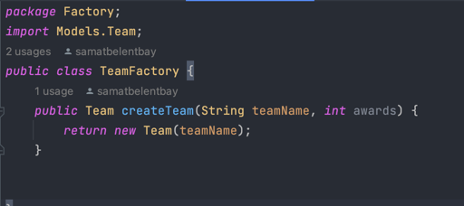
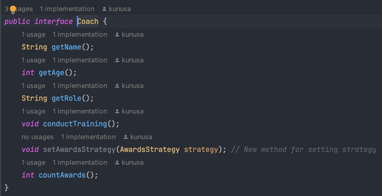

Final Project – Belentbay Samat, Abildinova Alua, SE-2206, SE-2205
“Hoopify” – basketball informational app.

Project overview
Main idea:
The main idea of the project is to create an informational system for tracking the stats and history of some players. In the project, different software design patterns were implemented in order to obtain practical knowledge from course “Software Design Patterns”.

Aim:
Our overarching aim is to effectively implement diverse software design patterns within the project framework, assessing their functionality and collective efficacy in enhancing the overall system. This endeavor not only underscores the application of theoretical knowledge acquired during the course but also underscores a commitment to cultivating a nuanced understanding of the practical implications of these design patterns in real-world scenarios.

Project objectives:
1)	User Interface Responsiveness:
      Ensure a responsive and user-friendly interface to facilitate seamless navigation and interaction with the “Hoopify” app.
2)	Pattern Implementation Mastery:
      Demonstrate a comprehensive understanding of various software design patterns by successfully implementing and integrating them into the project.
3)	Scalability and Flexibility:
      Design the system to be scalable, allowing for the addition of new features and accommodating potential future enhancements.
4)	Collaborative Development:
      Foster effective collaboration among team members through regular communication and version control, ensuring a cohesive and well-integrated final product.
5)	Adherence to Design Principles:
      Ensure that the implemented design patterns align with established software design principles, promoting code maintainability and readability.

Main part
1)	Factory pattern:
      We have two factory classes: PlayerFactory and TeamFactory.

PlayerFactory:
This factory is responsible for creating instances of the Player class. It encapsulates the instantiation details, allowing the client code to create players without directly invoking the new operator on the Player class. It's particularly useful when the process of creating a Player object involves complex logic or when you want to centralize the creation process.
    
TeamFactory:
Similarly, the TeamFactory is designed to create instances of the Team class. It abstracts away the details of creating a team, providing a clean interface for the client code to generate teams without needing to understand the intricacies of the team creation process. This separation of concerns enhances modularity and maintainability.
    

Why Use the Factory Design Pattern:

•	Encapsulation:
The Factory pattern encapsulates the object creation process, hiding the details and providing a simplified interface for clients.
•	Code Flexibility:
It allows for easy modification of the creation process without altering the client code, promoting flexibility and adaptability.
•	Centralized Control:
By centralizing the object creation in factories, you gain better control over the instantiation process, facilitating maintenance and debugging.
•	Code Reusability:
The pattern promotes code reusability by consolidating the creation logic in one place, reducing redundancy in the codebase.

The factories are used to create instances of Player and Team objects with specified attributes, streamlining the database insertion process. So, this adheres to the Factory Design Pattern's core principles of abstraction, encapsulation, and providing a centralized mechanism for object creation.
    

2)	Singleton pattern:
      We have implemented the Singleton pattern in the class – DatabaseConnection. The Singleton pattern ensures that a class has only one instance and provides a global point of access to it.

Singleton Usage in the DatabaseConnection Class:

•	Single Instance Creation:
The class contains a private static instance of itself (private static DatabaseConnection instance;) that is initialized as null.
•	Private Constructor:
The class has a private constructor (private DatabaseConnection()) that can only be accessed within the class. This prevents external classes from creating new instances.
•	Static Instance Retrieval Method:
The class provides a public static method (public static DatabaseConnection getInstance()) to retrieve the instance of the class. This method ensures that only one instance of the DatabaseConnection class is created.  
    
    
Usage:
    

3)	Decorator pattern:
      The implementation of “Decorator pattern” in our final project looks like this:
          
          
      •	TeamComponent Interface: This is the component interface, which defines the base behavior that all concrete components (e.g., Team) must implement. It includes methods like name(), toString(), and update().
      •	TeamDecorator Class: This class acts as the base decorator. It implements the TeamComponent interface and contains a reference to a wrapped TeamComponent (composition). It provides default implementations for the interface methods by delegating to the wrapped TeamComponent. This allows for a chain of decorators to be applied to the core object.
      •	TeamWithChampionships Class: This is a concrete decorator that extends TeamDecorator. It adds the "Championships" attribute to a Team object. The toString() method is overridden to include information about the championships.
      •	TeamWithCoach Class: Another concrete decorator that extends TeamDecorator. It adds the "Coach" attribute to a Team object. The toString() method is overridden to include information about the coach.

4)	Observer Pattern
          
          

Usage:
    
We used  Observer Pattern to make sure that when one thing changes, other things that care about it are automatically informed and updated. It's like getting notifications on our phone when someone posts a new message, so we always know what's going on without constantly checking.

5)	Adapter pattern:
      Adapter in our project is used to allow a Player object to be used as a Coach. It adapts the Player class to the Coach interface, so that a player can perform coaching activities while maintaining the same interface as a coach. This is helpful when we want to reuse player objects as coaches without modifying the Player class or the Coach interface.
         

6)	Strategy pattern:
         
         

We implemented Strategy Pattern  here to allow different ways of counting awards (in our case, championships) for coaches. It lets you change the counting method without modifying the Coach or Player classes.

UML diagram
   

Conclusion

To conclude, we want to say, that final project was not so hard to complete because of the knowledge that we obtained during our course. This project demonstrates the usage of six software design patterns together: Factory, Singleton, Adapter, Decorator, Observer and Strategy. The code is well structured, flexible and maintainable. That is because of design patterns. Also, this project has database connection that is also been interacted with design patterns.

Challenges faced:
Error handling: Handling: Properly handling exceptions and errors, both in database operations and in the application's logic, was crucial to ensure robustness.
Code Structure: Organizing the code to maintain clarity and readability, especially when
dealing with multiple classes and patterns, required thoughtful planning.
Pattern Implementation: Ensuring correct implementation of design patterns, especially in
cases where multiple patterns interacted, required careful consideration and testing.

